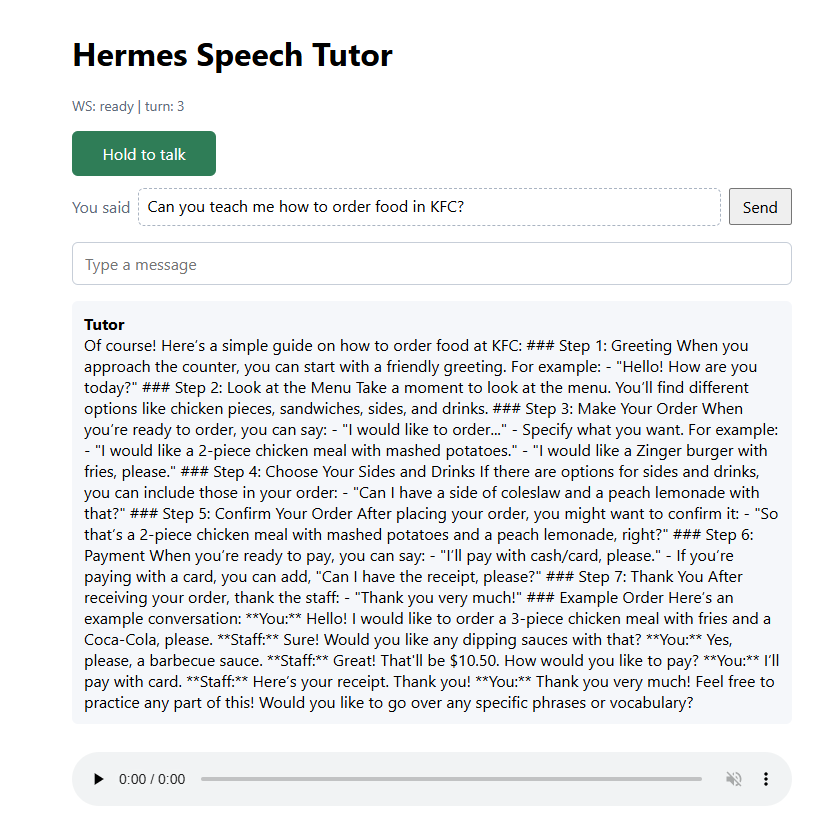

# Hermes Speech Tutor

Browser-based AI speech tutor prototype with explicit voice-turn orchestration, swappable speech/LLM providers, and a clear production path toward learner memory and retrieval-backed personalization.

## From MVP To Production

- **Current MVP:** two browser voice paths: an explicit `STT -> LLM -> TTS` pipeline with transcript review, and a direct multimodal voice route.
- **Production direction:** **Personalized Practice Starters**, a retrieval-backed personalization layer that turns learner history, correction patterns, session summaries, curriculum goals, and lesson content into targeted speaking tasks.

## What It Does Today

Hermes validates two local voice interaction paths:

```text
Traditional pipeline:
browser mic -> STT -> transcript review -> LLM -> TTS -> playback

Direct multimodal route:
browser mic -> multimodal LLM voice interaction -> playback
```

The most important design choice is that Hermes preserves the **raw STT transcript** separately from the learner's **corrected meaning**. That lets the tutor use the corrected text for conversation while keeping the original spoken evidence available for future pronunciation, fluency, and correction analysis.



## Why This Project Exists

Many AI voice demos collapse the whole interaction into one opaque model call. That is not enough for a production speech tutor.

A speech tutor needs to reason about:

- what the learner actually said
- what the speech recognizer may have misheard
- whether the explicit STT -> LLM -> TTS pipeline or a direct multimodal voice model should own a given tutoring flow
- which provider should handle STT, LLM, TTS, and pronunciation
- what learner data is safe to store and retrieve
- how prompts, correction policy, latency, privacy, and evals evolve after MVP

Hermes is intentionally scoped as a Phase 1 architecture slice: prove the hard speech loop first, then add tutoring intelligence, learner memory, and curriculum-aware personalization on top of a working system.

## Current Architecture

Hermes keeps the traditional pipeline and direct multimodal route visible as separate architecture choices.

### Traditional Pipeline

The backend owns the explicit `STT -> LLM -> TTS` voice-turn flow over WebSocket instead of hiding it behind a black-box chatbot request.

```text
turn.start
  -> audio frames
  -> turn.stop
  -> STT
  -> transcript ready
  -> learner confirms or edits transcript
  -> turn.send
  -> LLM stream
  -> TTS sentence chunks
  -> playback
  -> turn.done
```

That explicit turn model makes latency, debugging, cancellation, transcript correction, and future persistence easier to reason about.

### Direct Multimodal Route

The direct multimodal route sends browser audio into a multimodal voice model and returns spoken playback without separate STT and TTS provider hops.

```text
browser mic
  -> multimodal LLM voice interaction
  -> playback
```

This route is useful as a product and architecture comparison point. It may offer a smoother interaction loop, while the traditional pipeline gives Hermes stronger transcript visibility, correction review, provider-level control, and debuggability. A production tutor may keep both paths if they serve different modes: direct voice for low-friction conversation, explicit pipeline for correction-heavy tutoring where raw transcript evidence matters.

## Implemented Provider Strategy

Hermes separates product flow from vendor-specific SDK code through provider protocols in `server/providers/protocols.py`.

| Layer | Current implementations | Why it matters |
| --- | --- | --- |
| STT | OpenAI STT, faster-whisper | Compare paid hosted transcription with local/dev transcription. |
| LLM | OpenAI, Anthropic | Keep tutor orchestration independent of one model provider. |
| TTS | OpenAI TTS, edge-tts | Compare quality, cost, latency, and dev ergonomics. |
| Pronunciation | Null provider protocol | Reserve a clean boundary for later pronunciation analysis. |

This keeps provider selection as an architectural decision instead of something baked into the UI or turn flow.

## What The Prototype Proves

- A learner can speak in the browser and hear a spoken tutor response.
- The traditional voice pipeline works end to end: mic capture, STT, transcript review, LLM response, TTS, and playback.
- The direct multimodal route gives a second interaction model to compare against the explicit pipeline.
- A learner can correct speech-recognition errors while Hermes preserves the raw transcript.
- OpenAI and faster-whisper STT run behind the same interface.
- OpenAI TTS and edge-tts run behind the same interface.
- OpenAI and Anthropic LLM paths are isolated behind an LLM provider protocol.
- Voice turns carry edited text, raw STT text, input source, and prosody context into prompt construction.
- The session prompt is frozen per session, which supports later prompt versioning, caching, and debugging.
- Latency logging and optional turn-level JSONL logs make the speech loop inspectable.
- Tests cover provider contracts, session behavior, STT utilities, prosody, TTS pipeline behavior, and WebSocket handling.


## Production Architecture Direction: Personalized Practice Starters

The current prototype proves the speech loop. The next high-leverage product layer is learner memory and retrieval-backed personalization.

**Personalized Practice Starters** are the first production personalization feature I would build on top of that layer. Instead of giving every learner a generic prompt like:

```text
Tell me about your day.
```

Hermes would retrieve from learner and curriculum context:

- learner level and goals
- prior correction patterns
- session summaries
- curriculum objectives
- lesson content
- learner interests and avoid-topics

Then it would generate targeted speaking tasks:

```text
1. Tell me about a recent work meeting. Try using past tense clearly.
2. Role-play checking into a hotel when there is a problem with your room.
3. Describe your favorite cafe in 60 seconds. Focus on word stress and pacing.
```

The goal is **learning-quality engagement**, not raw engagement. A good starter should match the learner's level, target a useful skill, avoid sensitive topics, and produce enough speech for meaningful feedback.

Architecturally, this would sit above the existing turn loop:

```text
LearnerProfile
  + SessionSummaries
  + CorrectionHistory
  + CurriculumGoal
  + LessonContent
  -> StarterService
  -> TutorTurnFlow
```

This feature forces the important production decisions: what learner data is stored, how long it is retained, what is safe to retrieve, how curriculum controls personalization, which LLM generates candidates, and how starter quality is evaluated.

More detail: `PERSONALIZED_PRACTICE_STARTERS.md`.

## Production Roadmap

Hermes is not production-ready yet. The current repo is the architecture substrate for the next production decisions.

Planned production work:

1. Add durable learner, session, utterance, correction, and summary persistence.
2. Define a CEFR-aware tutor policy for when to correct, how much to correct, and how to explain feedback.
3. Add learner memory and retrieval over curriculum goals, prior mistakes, session summaries, and lesson content.
4. Build Personalized Practice Starters as the first retrieval-backed personalization feature.
5. Version prompt components and store prompt versions with sessions.
6. Add evals for false-positive corrections, STT normalization, latency, role-play adherence, starter quality, and tutor tone.
7. Compare the explicit pipeline and direct multimodal route on transcript visibility, correction quality, cost, latency, privacy, and debuggability.
8. Add privacy, consent, retention, redaction, and deletion rules before storing learner history.
9. Dogfood with real L2 learners before claiming pedagogical effectiveness.

## Technical Decisions This Repo Surfaces

- **LLM orchestration:** the backend owns the turn lifecycle, prompt context, streaming response, TTS chunking, and completion state.
- **Provider selection:** STT, LLM, TTS, and pronunciation are isolated so quality, latency, cost, privacy, and vendor risk can be evaluated separately.
- **RAG/data pipeline path:** learner memory, session summaries, correction history, curriculum goals, and lesson content have clear attachment points before retrieval is added.
- **Privacy:** raw audio, transcripts, corrected meaning, debug logs, and future learner records are treated as sensitive data requiring explicit retention and consent policy.
- **Evaluation:** the roadmap calls out behavior-specific evals rather than relying on subjective demo quality.
- **Cross-functional clarity:** the docs separate product, pedagogy, privacy, evaluation, and engineering concerns so different stakeholders can discuss the same roadmap.

## Repo Tour

- `server/ws_handler.py` owns the WebSocket voice-turn orchestration.
- `server/session.py` manages session state and freezes the session prompt.
- `server/prompt_builder.py` builds the tutor prompt from `SOUL.md`.
- `server/providers/protocols.py` defines the STT, LLM, TTS, and pronunciation boundaries.
- `server/providers/stt_openai.py` and `server/providers/stt_faster_whisper.py` implement STT providers.
- `server/providers/llm_openai.py` and `server/providers/llm_anthropic.py` implement LLM providers.
- `server/providers/tts_openai.py` and `server/providers/tts_edge.py` implement TTS providers.
- `server/prosody.py` extracts early voice/prosody features.
- `server/latency_log.py` and `server/turn_debug_log.py` provide observability hooks.
- `web/src/App.svelte` is the browser voice UI.
- `tests/` covers the critical backend seams.

## What This Is Not

- Not a finished tutoring product.
- No durable learner/session database yet.
- No full tutor persona or CEFR-aware correction policy yet.
- No real-user validation yet.
- No claim of pedagogical effectiveness yet.
- No production privacy, consent, retention, or deletion layer yet.

Those are intentional deferrals. Phase 1 proves the speech loop and architecture before layering on persistent tutoring behavior.

## Running The Project

Backend dependencies are managed with `uv` and require Python 3.11. The backend also requires `ffmpeg` on `PATH` or `FFMPEG_PATH` set in `.env`.

Install backend dependencies:

```powershell
uv sync
```

Install and build the frontend:

```powershell
cd web
npm ci
npm run build
cd ..
```

Start the full app from the backend:

```powershell
uv run uvicorn server.main:app --host 127.0.0.1 --port 8000
```

Then open `http://localhost:8000`.

`npm run dev` is useful for editing the Svelte UI, but the current WebSocket client connects to `/ws` on the same host. The full voice loop should be tested through the FastAPI backend unless a Vite WebSocket proxy is added.

Key environment settings are defined in `server/config.py`. Defaults use OpenAI for STT, LLM, and TTS. `OPENAI_API_KEY` is required. `ANTHROPIC_API_KEY` is required only when `LLM_IMPL=anthropic`.

## Tests

```powershell
uv run pytest
```

## Suggested Review Path

Start here, then read the deeper docs based on what you want to inspect:

- `ARCHITECTURE.md` for system structure and turn flow.
- `PROMPT_ARCHITECTURE.md` for prompt/session design.
- `MEMORY_AND_STATE_STRATEGY.md` for learner memory and persistence direction.
- `EVAL_STRATEGY.md` for evaluation strategy.
- `PRODUCTION_GAP_ANALYSIS.md` for the gap between this prototype and production.
- `PERSONALIZED_PRACTICE_STARTERS.md` for the production personalization/RAG feature.

## Summary

Hermes is a working MVP architecture slice for an AI speech tutor. It proves the browser speech loop, keeps provider decisions modular, preserves raw spoken evidence separately from corrected meaning, and defines a concrete path toward production-grade learner memory, privacy, evals, and retrieval-backed personalization.
